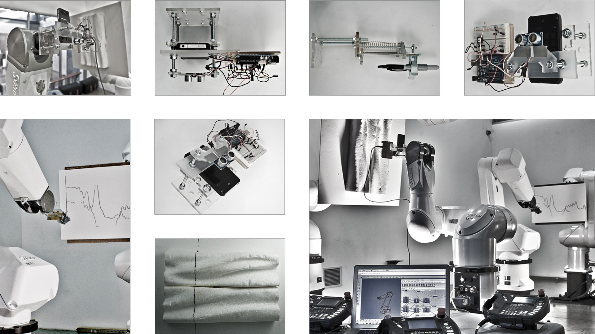
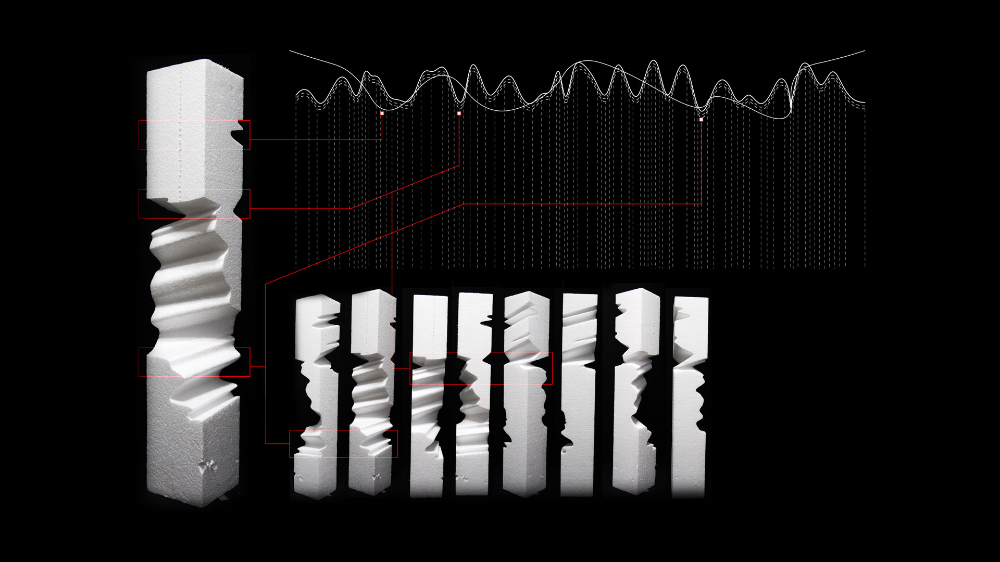
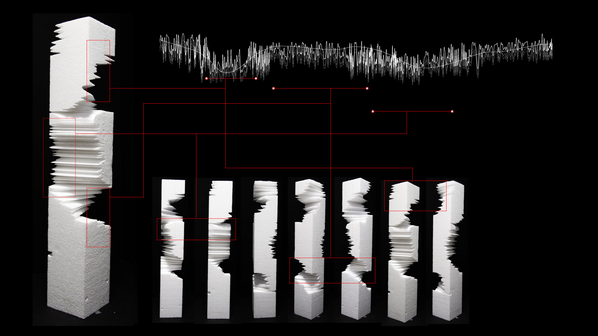
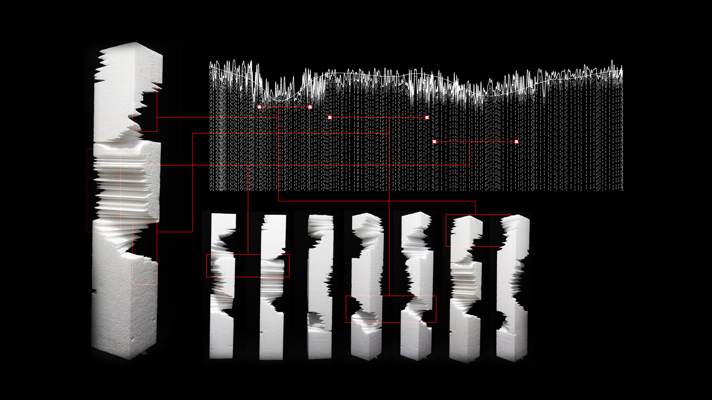

**RoboFab** is a experimental setup for the advanced digital  fabrication to explore the basic robotic synchronous. In these series of expeiment we have setup 4 robot arm choreography to fold, cut, weave, scan and draw.

<iframe src="https://player.vimeo.com/video/33130823?title=0&byline=0&portrait=0" style="position:absolute;top:0;left:0;width:100%;height:100%;" frameborder="0" webkitallowfullscreen mozallowfullscreen allowfullscreen></iframe>

 

