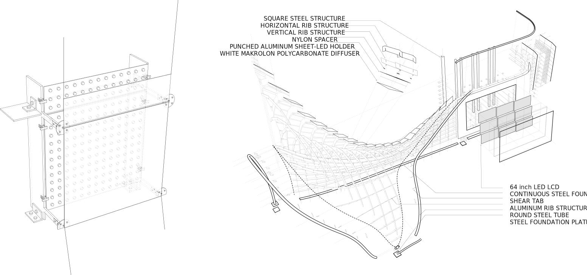

**Immersive Video Art Installation**

Design consultant for a permanent video installation  located in directv headquarter in el segundo california. Digital fabrication  techniques are used  throughout the design along with  computational design methoud  to video map more than 50,00 LED node on the 3d space.

&nbsp;

<iframe src="https://player.vimeo.com/video/92106456?loop=1&color=ff9933&title=0&byline=0&portrait=0" style="position:absolute;top:0;left:0;width:100%;height:100%;" frameborder="0" webkitallowfullscreen mozallowfullscreen allowfullscreen></iframe>

&nbsp;

